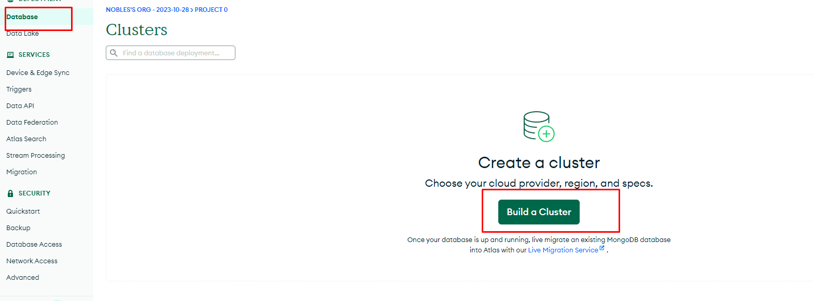
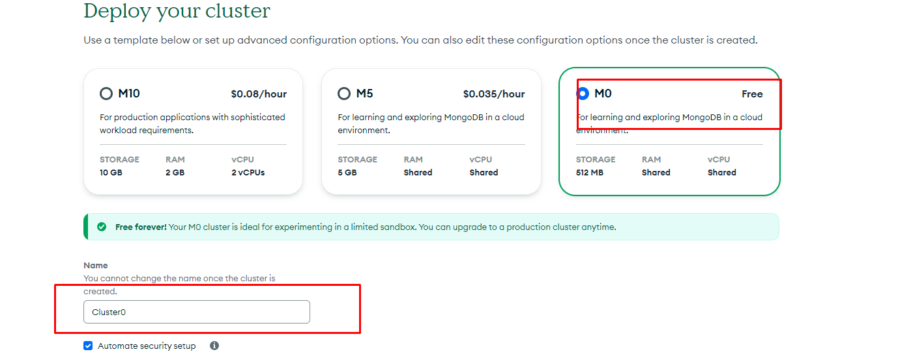
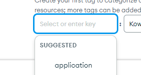
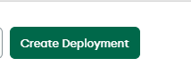
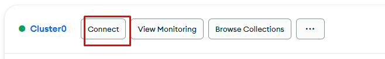
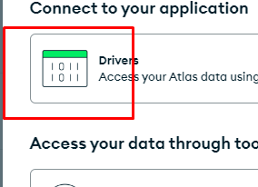

# Kurusaki
A multipurpose discord bot.

You will need [python version 3.11](https://www.python.org/downloads/) for wavelink v3+ to be properly installed. 


## Installing/Setting up Lavalink server.
#### You will need lavalink version 4+ for this to work.

Open application.yaml file inside the <b>lavalink/</b> folder and adjust customize the settings to your needs.

Next just run the server by using the command `java -jar Lavalink.jar` You can also specify max and min memory usage via `-Xmx` (max memory usage) or `-Xms` (min memory start up usage)

### Running the Discord bot
To run the discord bot, simply start the `kurusaki.py` file 
<br>
`
python3 kurusaki.py
`
### Cogs
Currently these are the "working" cogs for the bot
```python
[
    'Cogs.member',
    'Cogs.help',
    'Cogs.music',
    'Cogs.utility',
    'Cogs.events',
    'Cogs.text_channel',
    'Cogs.minecraft'
]
```
## <span style="color:red"> WARNING: </span> 
### Most commands will not work unless you setup a mongodb database which is free as this readme update.

#### Mongodb setup:

<h4>You can watch this video or following the instructions below.</h4>


[Mongodb setup Video](https://www.youtube.com)


<ol>
<li>

Create a free account at [mongodb](https://www.mongodb.com)
<li>

Create a cluster 



Give it a name, select the free one and add a tag and create the cluster.

Make sure to create a <b>Database</b> named `Discord-Bot-Database` a <b>collection</b> named General and the documents required with `_id` matching the ones in the code.


  
<li>

Connect to your new cluster and past the link into your bot's .env file by assigning it the key `MONGO` EX: `MONGO=YOUR_MONGO_DB_CONNECTION_URL_WITH_PASSWORD`




<span style="color: yellow"> NOTE: Make sure to replace `<password>` with your created password</span>
</ol>

</br>

## Enter `s.help` to view the commands that he bot.
## Visit [kurusaki website](https://kurusaki-api.gitbook.io/kurusaki-bot/) for better documentation  on how to use the bot
#### <span style="color: red">NOTE: </span>This bot uses mongodb as it's database, so you will need to create one or modify the code to use other databases or remove the cloud database functions completely.